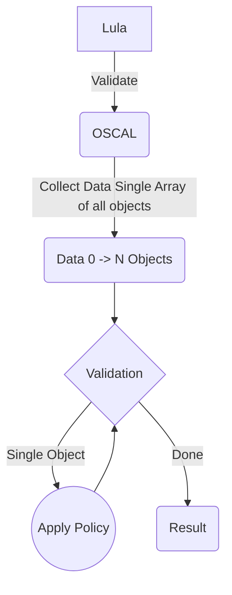
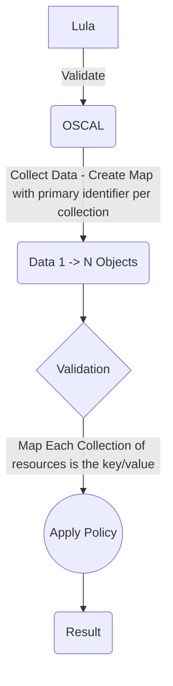

# 6. resource-collections

Date: 2023-11-22

## Status

Accepted

## Context

Lula has been using a data-collection and validation model where each object in the collection is validated individually. This tends to be standard practice from an admission system perspective. However, it is a constraint in the validation process the prevents us from conducting more wholistic and rich validation, as you cannot do cross-object validation. Furthermore it limits the policy writing process capabilities where the truth of the lula validation model should exist.

### Current Model

As described - the previous model performs a collection of 0 -> N objects for 0 -> N types of objects and places this in a single array. Each object in the array is then validated individually.

### Proposed Model

The proposed model is to create a single map with the primary identifier being the name of the collection. Validation will be performed against the entirety of the map. In this model we can further extend the underlying data and validation to be exposed in the OSCAL Component Definitions. Lula will then be positioned to allow validation developers to write more rich functionality that can be applied to allow cross-object validation. 

## Decision

The decision is to adopt the proposed resource-collections model. This involves transitioning from the current practice of validating individual objects within a collection to validating the entire collection as a single map, with the primary identifier being the name of the collection. This transition is expected to enable more wholistic and rich validation, allowing for cross-object validation and enhancing the capabilities of the policy writing process in Lula.

## Consequences

1. **Holistic Validation:** The proposed model allows for the validation of entire collections, enabling a more comprehensive and holistic validation process compared to the current practice of validating individual objects.

2. **Cross-Object Validation:** With the shift to a single map structure, cross-object validation becomes feasible. This enhances the validation capabilities, allowing for validations that span multiple objects within multiple collections.

3. **Policy Writing Flexibility:** The transition provides greater flexibility in the policy writing process. Developers can leverage the extended data and validation capabilities exposed in the OSCAL Component Definitions to write more sophisticated and rich validation logic.

4. **Improved Model Transparency:** The use of a single map with a clear primary identifier enhances the transparency of the validation process, making it easier to understand and manage.

Overall, this transition shifts more source of truth from Lula to OSCAL, allowing for more flexibility in the policy writing process.