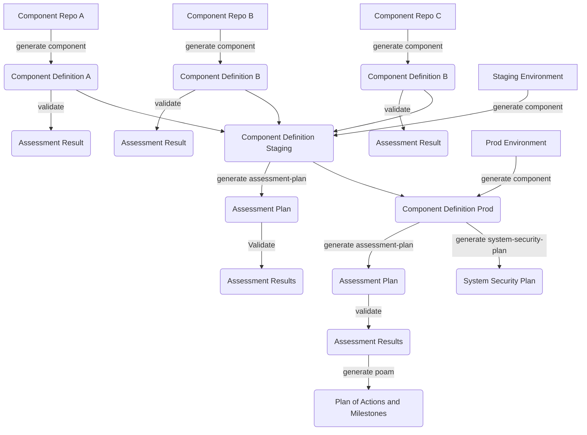

# 8. End to End OSCAL Artifact Strategy

Date: 2024-05-17

## Status

Proposed

## Context

A number of experiments have been conducted for the purpose of performing composable actions across multiple Open Security Controls Assessment Language (OSCAL) artifacts and models. While these do allow for centrally managing OSCAL through declarative manifests - they add overhead for additional tooling and orchestration. It also duplicates the intended behavior of OSCAL import fields. 

The OSCAL models are designed with support for identifying when data from one model should be imported into another model. Lula will both support and optimize the use of this intended functionality for purposes of enabling composable workflows between models as well as supporting artifacts. This import process can be an OSCAL-native to establish relationships across artifacts and models for which Lula can enrich to establish meaningful context and reporting for human-readable output. 

### OSCAL Context

Composing compliance and security control information for various components and systems relies upon the context required and the purpose of the artifact. The current [OSCAL models](https://pages.nist.gov/OSCAL/resources/concepts/layer/) are categorized into three layers:
- Controls layer
  > Defines a set of controls intended to reduce the risk to a system
- Implementation Layer
  > Implementation of a system under a specific baseline as well as the individual components that may be incorporated into a system
- Assessment Layer
  > Communicating all assessment findings including supporting evidence, and identifying and managing the remediation of identified risks to a system identified as a result of assessment activities

The controls layer and catalogs/profiles are often associated with an authority behind the regulatory information. These are not limited to authorities but can also be authored internal to organizations or shared in the open. The implementation layer builds upon intent authored in the controls layer and allows for the implementation of controls for a system to be authored in an System Security Plan (SSP) as well as modular components that could then comprise a system. With components of a system _and_ a system defined, the assessment of said system against one or many baselines may be conducted with resulting information available for assessment conducted, the results of said assessment, and plans for remediation of identified gaps or risks. 

Lula will operate against the intent of a Catalog baseline for the purpose of the intended context for which GRC information is being authored. The context will vary dependent on where in the lifecycle the information is being produced and consumed in the following pattern:
- A `component definition` will perform the mapping of one-to-many standards/benchmarks/policies to one-to-many system components
  - Where possible, a single `component definition` should focus on a single system component
- A `system security plan` will aggregate the collection of one-to-many `component definitions` into a single system definition
- An `assessment plan` will aggregate one-to-many `component-definitions` into a plan with depth of control satisfaction based upon many layers of implementation for any given control
- An `assessment result` will outline the state after assessment based upon the the result of each control as identified in the `assessment plan`
- A `plan of actions and milestones` will outline planned remediation for subsequent findings in the `assessment results` that were identified as not-satisfied

### Artifact Strategy

Given the context above, Lula will enrich the process through generation and the automation of artifacts and the content that comprises them. There are multiple workflows that allow for the similar outcomes - Lula focuses on enhancing the use of transient data from available context through the following but not limited to:
- Generation of a `component-definition` will allow for initial mapping of controls for one-to-many catalogs/standards for a given component
  - A `validation` is a Lula construct for automation for use in a body-of-evidence towards a control/implemented-requirement being `satisfied` or `not-satisfied`
  - A single control/implemented-requirement may have many `validations`
  - A `component definition` serves as both the reusable compliance information, as well as the interface for overriding validations from other imported/inherited control information for a given component
- A `component definition` can be validated using established `validations` to assess the component against an established threshold in isolation.
  - This threshold and output of a validation is represented in the `assessment results` model/artifact
- When a target environment has been established, multiple `component definitions` can be aggregated into a top-level `component definition` via the `import component definitions` field
  - This system `component definition` allows for additional context/controls/implemented-requirements to be added based upon configuration or potential inheritance
  - This system `component definition` will then be used for the generation of a `system security plan` and an `assessment plan`
    - It is intended that the `assessment plan` be used for performing automated validation against a system in accordance with Risk Management Framework processes
    - Performing validation with the `assessment plan` will produce `assessment result` artifacts which can be used for compliance threshold decision making as identified above
- With an `assessment result`, a `plan of actions and milestones` can be generated to outline the remediation of a system based on findings that were identified as `not-satisfied`

There may be additional workflows for generation and context-building within these artifacts that become advisable based on situational needs.

### Content Management

Lula will enable artifacts to be co-located in a single file or written to individually managed files. The [go-oscal](https://github.com/defenseunicorns/go-oscal) library and types for OSCAL were built to support a use-case where all OSCAL models can be represented as a single artifact. The single artifact representation allows for context sharing between models and the handling of the existing data.

Lula will enable models to be represented as one more many artifacts:
- Each model can be represented as a single artifact/file and references can be established between artifacts
  - This results in a collection of many files where each file may represent a given model
- All models can be represented as a single artifact/file and references can be established between models
  - This results in a single file containing all machine-readable information

Both scenarios will support composition/decomposition from one scenario to the other. The core focus of how Lula maintains the content of each model will be represented in the design principle for OSCAL data management that focuses on ensuring the existing data (whether generated, manually authored, or both) is retained across operations unless otherwise documented as owned by automation.

### Validation

A `validation` is automation used to provide process for the collection of some data and a policy that describes adherence of that data required for a given control. This automation will encompass technical and non-technical controls in order to facilitate the use of OSCAL for end-to-end accreditation. A `domain` is a Lula construct that exists to provide an interface and guardrails for the collection of data or performance of some audit. A `domain` provides the ability to establish guardrails while also enhancing the expected structure of inputs for a given `validation`. This means Lula will support automation that processes evidence for a given requirement provided the domain exists to enable processing the required data - enabling techical as well as non-technical requirements to be assessed. 

## Decision

## Consequences

