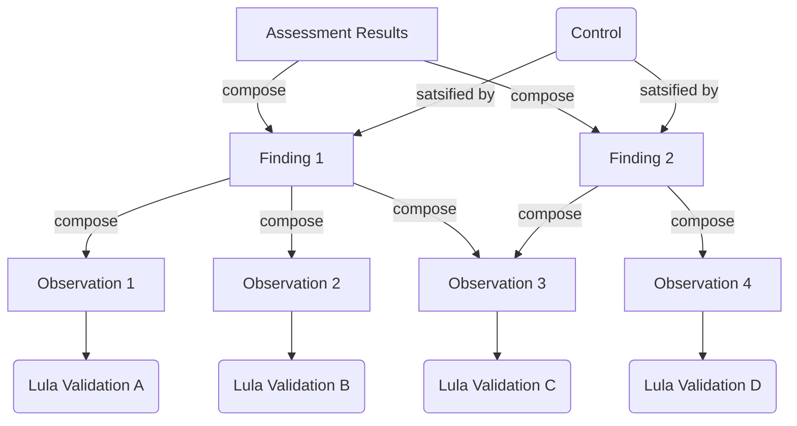

# Assessment Results

An [Assessment Result](https://pages.nist.gov/OSCAL/resources/concepts/layer/assessment/assessment-results/) is an OSCAL-specific model to report on the specific assessment outcomes of a system. In Lula, the `validate` function creates an `assessment-result` object to enumerate the asseement of the input controls provided by the `component-definition`. These are reported as finding that are `satisfied` or `not-satisfied` as a result of the observations performed by the Lula validations.

## Observation Results
Based on the structure outlined, the results of the observations impact the findings, which in turn result in the decision for the control as `satisfied` or `not-satisfied`. The observations are aggregated to the findings as `and` operations, such that if a single observation is `not-satisifed` then the associated finding is marked as `not-satisfied`.

The way Lula performs evaluations default to a conservative reporting of a `not-satisified` observation. The only `satisfied` observations occur when a domain provides resources and those resources are evaluated by the policy such that the policy will pass. If a Lula Validation [cannot be evaluated](#not-satisfied-conditions) then it will by default return a `not-satisfied` result.

### Not-satisfied conditions
The following conditions enumerate when the Lula Validation will result in a `not-satified` evaluation. These cases exclude the case where the Lula validation policy has been evaluated and returned a failure.
- Malformed Lula validation -> bad validation structure
- Missing resources -> No resources are found as input to the policy
- Missing reference -> If a remote or local reference is invalid
- Executable validations disallowed -> If a validation is executable but has not been allowed to run