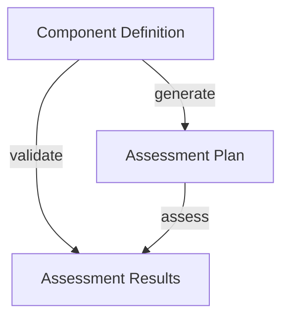

# Assessment

The Assessments suite of Lula commands are intended to facilitate the generation of `assessment-plans` and `assessment-results` from `component-defintion` models. The following diagram indicates the OSCAL model inputs, commands, and output OSCAL models expected from each of these commands.

