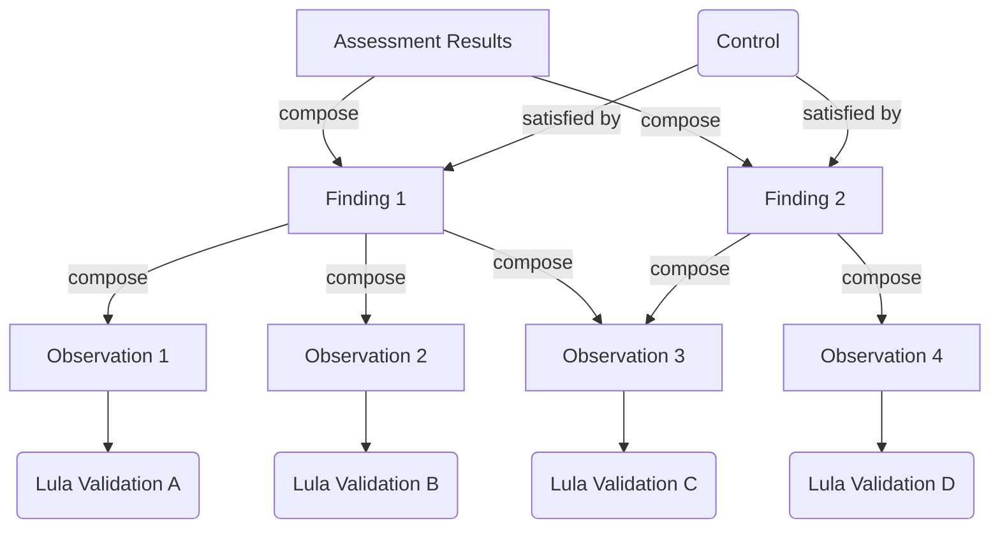

# Assessment Results

An [Assessment Result](https://pages.nist.gov/OSCAL/resources/concepts/layer/assessment/assessment-results/) is an OSCAL model to report on the specific assessment outcomes of a system. In Lula, the `validate` command creates an `assessment-result` object to enumerate the assessment of the input controls provided by the `component-definition`. These are reported as findings that are `satisfied` or `not-satisfied` as a result of the observations performed by the Lula validations.


## Observation Results
Based on the structure outlined, the results of the observations impact the findings, which in turn result in the decision for the control as `satisfied` or `not-satisfied`. The observations are aggregated to the findings as `and` operations, such that if a single observation is `not-satisfied` then the associated finding is marked as `not-satisfied`.

The way Lula performs evaluations default to a conservative reporting of a `not-satisfied` observation. The only `satisfied` observations occur when a domain provides resources and those resources are evaluated by the policy such that the policy will pass. If a Lula Validation [cannot be evaluated](#not-satisfied-conditions) then it will by default return a `not-satisfied` result.

### Not-satisfied conditions
The following conditions enumerate when the Lula Validation will result in a `not-satisfied` evaluation. These cases exclude the case where the Lula validation policy has been evaluated and returned a failure.
- Malformed Lula validation -> bad validation structure
- Missing resources -> No resources are found as input to the policy
- Missing reference -> If a remote or local reference is invalid
- Executable validations disallowed -> If a validation is executable but has not been allowed to run

## Structure
The primary structure for Lula production and operation of `assessment-results` for determinism is as follows:
- Results are sorted by `start` time in descending order
- Findings are sorted by `target.target-id` in ascending order
- Observations are sorted by `collected` time in ascending order
- Back Matter Resources are sorted by `title` in ascending order.

## Compliance Evaluation

Lula `evaluate` serves as a method for verifying the compliance of a component/system to determine if it is more or less compliant than a previous assessment. This enables OSCAL to serve as a quality gate for compliance evaluation - enabling automation and requiring governance of component or system updates.

### Threshold

The term `threshold` is used in Lula processes and workflows to delineate (optimally) a point-in-time where a component/system was most compliant. In identifying this state, a quality gate can be created to require meeting or exceeding said threshold. 

The reason this is crucial is that the previous assessment may not always be the required state. Rather Lula allows capturing provenance for when that state was established and enabling teams to increment Automated Governance workflows. This may be allowing for failures until the assessments have a high level of fidelity in order to parallelize development.

### Expected Process

#### No Existing Data

When no previous assessment exists, the initial assessment is made and stored with `lula validate`. Lula will automatically apply the [threshold](./ns/threshold.md) prop to the assessment result when writing the assessment result to a file that does not contain an existing assessment results artifact. This initial assessment by itself will always pass `lula evaluate` as there is no threshold for evaluation, and the threshold prop with be set to `true`.

steps:
1. `lula validate -f component.yaml -o assessment-results.yaml`
2. `lula evaluate -f assessment-results.yaml` -> Passes with no Threshold -> Establishes Threshold

#### Existing Data (Intended Workflow)

In workflows run manually or with automation (such as CI/CD), there is an expectation that the threshold exists, and evaluate will perform an analysis of the compliance of the system/component against the established threshold.

steps:
1. `lula validate -f component.yaml -o assessment-results.yaml`
2. `lula evaluate -f assessment-results.yaml` -> Passes or Fails based on threshold


### Scenarios for Consideration

Evaluate will determine which result is the threshold based on the following property:
```yaml
props:
  - name: threshold
    ns: https://docs.lula.dev/oscal/ns
    value: "true/false"
```

#### Assessment Results Artifact

When evaluate is ran with a single assessment results artifact, it is expected that a single threshold with a `true` value exists. This will be identified and ran against the latest result to determine if compliance is less-than-equal (fail), equal (pass), or greater-than-equal (pass). When the comparison results in greater-than-equal, Lula will update the threshold `prop` for the latest result to `true` and set the previous result threshold prop to `false`.

#### Comparing multiple assessment results artifacts

In the scenario where multiple assessment results artifacts are evaluated, there may be a multiple threshold results with a `true` value as Lula establishes a default `true` value when writing an assessment results artifact to a new file with no previous results present. In this case, Lula will use the older result as the threshold to determine compliance of the result.