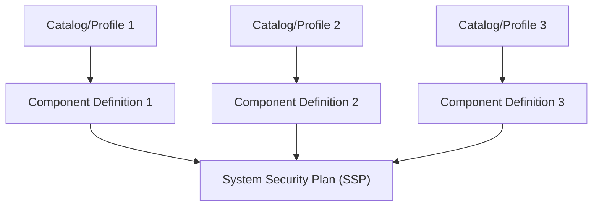

# System Security Plan

A [System Security Plan](https://pages.nist.gov/OSCAL/resources/concepts/layer/implementation/ssp/) is an OSCAL-specific model to represent a system as a whole. In Lula, the `generate system-security-plan` command creates an `oscal-system-security-plan` object to explain the system as a whole by using the compliance data provided by the `component-definition`. The System Security Plan will detail each contributor and groups of contributors that play any part in the system's lifecycle. It will also include every `component` that make up the system with each `implemented-requirement` that details the controls each tools helps to satisfy and how.

## Metadata

Includes all `responsible parties`, `parties`, and `roles` that play a part in the system. Responsible parities are the collection of contributors who are responsible for the maintenance and development of the system. Parties includes any internal or external collection of contributors that contribute to the system or the lifecycle of the system. Roles are the designated positions contributors take within the system and system's lifecycle.

`Version` is the specific revision of the document. `Revision` is a sequential list of revisions such as `predecessor-version`, `successor-version`, and `version-history`. These fields track the history of the document as changes are made.

## System Characteristics

Describes the system and the systems security requirements. This includes the `security-sensitivity-level` which is the overall system's sensitivity categorization as defined by [FIPS-199](https://nvlpubs.nist.gov/nistpubs/FIPS/NIST.FIPS.199.pdf). The system's overall level of expected impact resulting from unauthorized disclosure, modification, or loss of access to information through `security-impact-level` children items of `security-objective-confidentiality`, `security-objective-integrity`, and `security-objective-availability`.

The System Characteristics also outline the impacts to risk specifically based on `confidentiality-impact`, `integrity-impact`, and `availability-impact` with the supporting data.

The system characteristics also includes the `authorization-boundary`, `network-architecture`, and `data-flow` diagrams or links to the location of the diagrams. The `authorization-boundary` diagram outlines everything within the environment and is in scope for the system's compliance framework. The `network-architecture` focuses on the network connections made within the system to include port and protocol. Lastly the `data-flow` diagram shows the flow of data within the system as it moves.

The `system-information` field contains all of the details about the type of data stored, processed, and transmitted by the system. The possible options are `fips-199-low`, `fips-199-moderate`, and `fips-199-high`. Consult NIST [800-60](https://nvlpubs.nist.gov/nistpubs/Legacy/SP/nistspecialpublication800-60v2r1.pdf) for help defining the system.

## System Implementation

Contains any `leveraged-authorizations`, if used, all `components` used to build the system, all `users` with their type and access levels listed, and `inventory-items` detailing how the overall system is configured. The `inventory-items` is a large collection of everything that lives within the system such as operating systems and infrastructure. In addition the `responsible-parties` are listed and connected to each piece they are responsible for.

## Control Implementation

Contains all of the compliance controls the system must adhere to as outlined within the `profile`. Each `implemented-requirement` is listed detailing the control and the information of how the system meets the control on a `by-component` instance. The component will outline all `export`, `inherited`, and `satisfied` indications for each control the component represents.
