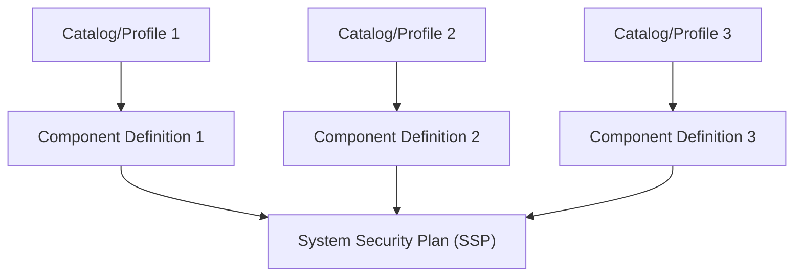

# System Security Plan

A [System Security Plan](https://pages.nist.gov/OSCAL/resources/concepts/layer/implementation/ssp/) is an OSCAL-specific model to represent a system as a whole. In Lula, the `generate system-security-plan` command creates an `oscal-system-security-plan` object to explain the system as a whole by using the compliance data provided by the `component-definition`. The System Security Plan will detail each contributor and groups of contributors that play any part in the system's lifecycle. It will also include every `component` that make up the system with each `implemented-requirement` that details the controls each tools helps to satisfy and how.



## Metadata

Includes all `responsible parties`, `parties`, and `roles` that play a part in the system. Responsible parities are the collection of contributors who are responsible for the maintenance and development of the system. Parties includes any internal or external collection of contributors that contribute to the system or the lifecycle of the system. Roles are the designated positions contributors take within the system and system's lifecycle.

`Version` is the specific revision of the document. `Revision` is a sequential list of revisions such as `predecessor-version`, `successor-version`, and `version-history`. These fields track the history of the document as changes are made.

## System Characteristics

Describes the system and the systems security requirements. This includes the `security-sensitivity-level` which is the overall system's sensitivity categorization as defined by [FIPS-199](https://nvlpubs.nist.gov/nistpubs/FIPS/NIST.FIPS.199.pdf). The system's overall level of expected impact resulting from unauthorized disclosure, modification, or loss of access to information through `security-impact-level` children items of `security-objective-confidentiality`, `security-objective-integrity`, and `security-objective-availability`.

The System Characteristics also outline the impacts to risk specifically based on `confidentiality-impact`, `integrity-impact`, and `availability-impact` with the supporting data.

The system characteristics also includes the `authorization-boundary`, `network-architecture`, and `data-flow` diagrams or links to the location of the diagrams. The `authorization-boundary` diagram outlines everything within the environment and is in scope for the system's compliance framework. The `network-architecture` focuses on the network connections made within the system to include port and protocol. Lastly the `data-flow` diagram shows the flow of data within the system as it moves.

The `system-information` field contains all of the details about the type of data stored, processed, and transmitted by the system. The possible options are `fips-199-low`, `fips-199-moderate`, and `fips-199-high`. Consult NIST [800-60](https://nvlpubs.nist.gov/nistpubs/Legacy/SP/nistspecialpublication800-60v2r1.pdf) for help defining the system.

## System Implementation

Contains any `leveraged-authorizations`, if used, all `components` used to build the system, all `users` with their type and access levels listed, and `inventory-items` detailing how the overall system is configured. The `inventory-items` is a large collection of everything that lives within the system such as operating systems and infrastructure. In addition the `responsible-parties` are listed and connected to each piece they are responsible for.

## Control Implementation

Contains all of the compliance controls the system must adhere to as outlined within the `profile`. Each `implemented-requirement` is listed detailing the control and the information of how the system meets the control on a `by-component` instance. The component will outline all `export`, `inherited`, and `satisfied` indications for each control the component represents.

## System Security Plan Generation

**NOTE:** This command is in an active research phase.

To generate a system security plan, you need the following context:
- The component definition
- The profile source or catalog source

The following command could generate a system security plan with the above context:

```bash

lula generate system-security-plan --component .src/test/unit/valid-component.yaml --catalog https://raw.githubusercontent.com/usnistgov/oscal-content/main/nist.gov/SP800-53/rev5/json/NIST_SP-800-53_rev5_HIGH-baseline-resolved-profile_catalog.json

```

There are optional flags that can be added to the command to generate a system security plan:

- The output file of the component `-o` or `--output`; `oscal-system-security-plan.yaml`

## System Security Plan Generate Context

The `system-security-plan` can be generated using the upstream catalog and/or profile in conjunction with the `component-definition`. There are net new fields that are apart of the `system-security-plan` that are not within the `component-definition` or catalog/profile that currently do not make sense to add as props. Those items are under the section `Elements in SSP Not in Component Definition`. There are items that are not in the `system-security-plan` but also not in the `component-definition` that currently do make sense to create as props. Those items are under the section `Elements NOT in Component Definition that need added for SSP Generate`. Lastly as a note there are items within the `component-definition` that are not used in the `system-security-plan` that can be found under the section Elements NOT in `Component Definition that need added for SSP Generate`.

The items in `Elements in SSP Not in Component Definition` need further context to fill in the missing elements as well as establish data across OSCAL models. Some examples of the data fields are within the `metadata` fields such as `responsible-roles`, `responsible-parties`, and `parties` that can be added to the `system-security-plan` that do not directly map from the `component-definition` field. Additional context can be added through common OSCAL fields such as `props`, `links`, and `remarks`.

### Further Research Fields

The following fields need further research to further enhance generating an SSP.

- `inherited`
- `export`

### Elements in Component Definition Not in SSP

- `import-component-definitions`
- `capabilities`
  - `uuid`
  - `name`
  - `description`
  - `props`
  - `links`
  - `incorporates-components`
    - `component-uuid`
    - `description`

### Elements in SSP Not in Component Definition

- `system-characteristics`
  - `system-ids`
    - `identifier-type`
    - `id`
  - `system-name`
  - `system-name-short`
  - `description`
  - `security-sensitivity-level`
  - `system-information`
    - `information-types`
      - `id`
      - `title`
      - `description`
      - `security-objective-confidentiality`
      - `security-objective-integrity`
      - `security-objective-availability`
  - `security-impact-level`
    - `security-objective-confidentiality`
    - `security-objective-integrity`
    - `security-objective-availability`
  - `status`
    - `state`
    - `remarks`
  - `authorized-boundary`
    - `description`
    - `props`
    - `links`
    - `diagrams`
      - `uuid`
      - `description`
      - `props`
      - `links`
      - `caption`
      - `remarks`
    - `remarks`
  - `network-architecture`
    - `description`
    - `props`
    - `links`
    - `diagrams`
      - `uuid`
      - `description`
      - `props`
      - `links`
      - `caption`
      - `remarks`
    - `remarks`
  - `data-flow`
    - `description`
    - `props`
    - `links`
    - `diagrams`
      - `uuid`
      - `description`
      - `props`
      - `links`
      - `caption`
      - `remarks`
    - `remarks`
  - `props`
  - `links`
  - `remarks`
- `system-implementation`
  - `users`
    - `uuid`
    - `title`
    - `short-name`
    - `description`
    - `props`
    - `links`
    - `role-ids`
    - `authorized-privileges`
      - `title`
      - `description`
      - `functions-performed`
    - `remarks`
  - `leveraged-authorizations`
    - `uuid`
    - `title`
    - `props`
    - `links`
    - `party-uuid`
    - `date-authorized`
    - `remarks`
  - `inventory-items`
    - `uuid`
    - `description`
    - `props`
    - `links`
    - `remarks`
- `control-implementation`
  - `implemented-requirements`
    - `statements`
      - `satisfied`
        - `uuid`
        - `responsibility`
        - `description`
        - `props`
        - `links`
        - `responsible-roles`
          - `role-id`
          - `props`
          - `links`
          - `party-uuid`
          - `remarks`
        - `role-ids`
    - `by-components`
      - `satisfied`
        - `uuid`
        - `responsibility`
        - `description`
        - `props`
        - `links`
        - `responsible-roles`
          - `role-id`
          - `props`
          - `links`
          - `party-uuid`
          - `remarks`
        - `role-ids`

### Elements NOT in Component Definition that need added for SSP Generate

- `control-implementation`
  - `implemented-requirements`
    - `by-components`
      - `implementation-status`
        - `state`
        - `remarks`
    - `statements`
      - `by-components`
        - `implementation-status`
          - `state`
          - `remarks`

### Component Definition to SSP Transferable Fields

### **NOTE:** repetitive children elements have been truncated to reduce bloat

- `metadata`
  - `title`
  - `published`
  - `last-modified`
  - `version`
  - `oscal-version`
  - `revisions`
  - `document-ids`
  - `props`
  - `links`
  - `roles`
  - `locations`
  - `actions`
- `control-implementation`
  - `description`
  - `set-parameters`
    - `param-id`
    - `values`
    - `remarks`
  - `implemented-requirements`
    - `uuid`
    - `control-id`
    - `props`
    - `links`
    - `set-parameters`
      - `param-id`
      - `values`
      - `remarks`
    - `statements`
      - `statement-id`
      - `props`
      - `responsible-roles`
      - `links`
      - `by-components`
    - `by-components`
      - `component-uuid`
      - `description`
      - `props`
      - `links`
      - `set-parameters`
        - `param-id`
        - `values`
        - `remarks`
  - `system-implementation` (Contains Fields from Component Definition)
    - `components`
      - `uuid`
      - `type`
      - `title`
      - `description`
      - `purpose`
      - `props`
      - `links`
      - `status`
      - `protocols`
    - `implemented-components`
      - `component-uuid`
      - `props`
      - `links`
