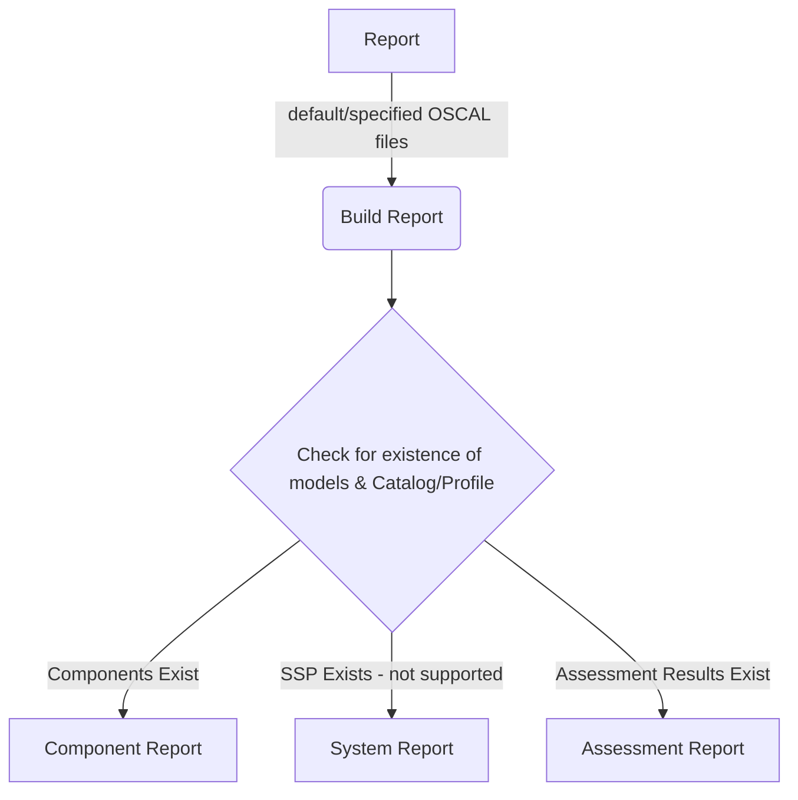

# Lula Compliance Reporting

Contextual reporting for the state of compliance with a given standard, benchmark, stig, or policy.

`lula report` will use context of default or specified OSCAL artifacts to perform an analysis on percentages met by components or systems.

## Context

### Considerations

Reporting will perform the analysis of control context from relevant OSCAL layers to provide a layered reporting of compliance.

## Reporting Layers

### Component Report

Component Reporting will provide the most generalized layer of controls against a given standard. Components may be comprised of multiple standards (control implementations) and as such will need to potentially collect multiple catalogs and profiles.

### System Report

System Reporting will provide a filter of controls against a given system. This is more specialized and focuses on a single system and the standard for which it is being accredited.

### Assessment Report

Assessment Reporting will provide more specialized reporting on the state of a given assessment. The state of a control `finding` will be analyzed and reported in the form of percentage controls being `satisfied/not-satisfied given a result.